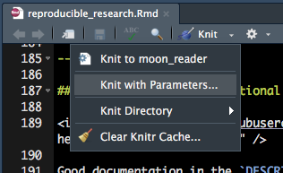

```{r setup, include=FALSE}
options(htmltools.dir.version = FALSE)
```

class: title-slide, left, middle, inverse

<h1> Reproducible Research in R </h1>

<br>


<h3> Katherine Simeon <br> R-Ladies Chicago</h3>

<br>
<h4> January 28, 2019 </h4>


---
class: left, middle

## This is inspired by multiple rstudio::conf talks  
  
Karthik Ram - [A guide to modern reproducible data science with R](https://github.com/karthik/rstudio2019)  
  
Amanda Gadrow - [Writing reliable & maintainable R code](https://github.com/ajmcoqui/testingRCode)  
  
Mike K Smith - [The lazy & easily distracted report writer: Using rmarkdown and parametrized reports](https://github.com/MikeKSmith/RStudioConf2019)  
  
Charlotte & Hadley Wickham - Building Tidy Tools Workshop  
  
---

# The motivation  
  
Research is hard!  
  
--
  
.center[]  

--
  
.right[Being organized is important!]  
  
---

## Good code should be...  
  

  
--
  
* Reliable & Reproducible    
* Flexible & Generalizable    
  
--
  
<br>
  
## In research, reproducibility allows us to...  
  
* Clearly communicate research methods & findings    
* Repeat & improve our techniques
  
---

# Research Compendium  
   
A **systematic** way to organize research data, analyses, and documentation.  
  
<br>
  
--
  
A good research compendium...  
  
* Keeps to the conventions of collaborators/peers (makes it <span style="color:#562457">**generalizable**</span>)  
  
--
  
* Keeps data, methods, and outputs separate (makes it <span style="color:#562457">**reliable**</span>)      
  
--
  
* Clearly specifies the computational environment to the best of its abilities (makes it <span style="color:#562457">**reproducible**</span>)
  
<br>
  
--
  
The structure of an R package already has this! 📦  
  
---

# The R package structure
  
```{r, eval=FALSE}  
A_PACKAGE  
    |
    ├── DESCRIPTION         # Important metadata! 
    |                       # Makes .Rproj recognized as a package
    ├── README.md
    |
    ├── NAMESPACE
    |
    ├── LICENSE
    |
    ├── R/                    # Functions that are in your package
    │   ├── UsefulFunction1.R       
    │   └── UsefulFunction2.R   
    |
    ├── man/                   # Documentation for functions
    │   ├── UsefulFunction1.Rd       
    │   └── UsefulFunction2.Rd 
    |
    └── A_package.Rproj     # R project file for your package
```
  
---

# An R package as a research compendium    
    
```{r, eval=FALSE}  
SAMPLE_COMPENDIUM  
    |
    ├── DESCRIPTION
    |
    ├── README.md
    |
    ├── LICENSE
    |
    ├── data/
    │   ├── raw_data/       # data obtained from elsewhere
    │   └── derived_data/   # data generated during the analysis
    |
    ├── analysis/           # contains scripts for analyses
        └── analysis.R
    |
    ├── paper/
    │   ├── paper.Rmd       # this is the main document to edit
    │   └── references.bib  # this contains the reference list information
    |
    └── figures/            # location of the figures produced by the Rmd
    
```
  
---
  
# Create a package!  
  
`usethis`
  
A [package](https://github.com/r-lib/usethis) that automates repetitive tasks in project development:  
```{r, eval=FALSE} 
usethis::create_package("packagename")
```
  
<br>
`rrtools`  
  
A [package](https://github.com/benmarwick/rrtools) that expands `devtools` and contains instructions and templates for a research compendium:  
```{r, eval=FALSE} 
create_compendium("packagename")
```
  
<br>
  
  
  
---
  
## Documenting the computational environment  
  
  
  
Good documentation in the `DESCRIPTION` (particularly for `Depends`, `Imports`, & `Suggests`).  
  
`containerit` [packages](https://github.com/o2r-project/containerit) R scripts, session, workspace and all dependencies as a [Docker](https://www.docker.com/) container.  
  
--
  
## Parameterized reports in RMarkdown  
  
  
  
For **reproducible** and **flexible** reporting & documentation, use:   `Knit with Parameters...`  
.center[] 
  
---
  
# Takeaways  
  
We need to document our research in a way that is <span style="color:#562457">**reliable**, **reproducible**, & **generalizable**</span>.  
  
R has a lot of tools to organize and disseminate research in a <span style="color:#562457">**systematic**</span> way.  
  
<br>
  
.center[     ]


---
class: center, middle, inverse  
  
# Thank you!  
  
<br>
  
.small[Slides at: `r fontawesome::fa("github")` [katherinesimeon](https://github.com/katherinesimeon)] 


   
